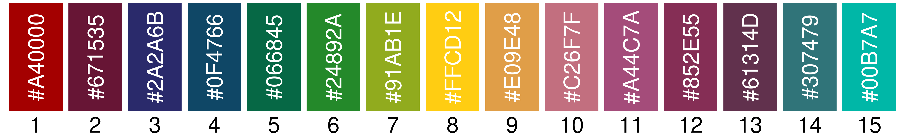
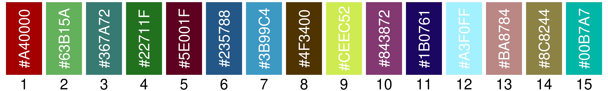
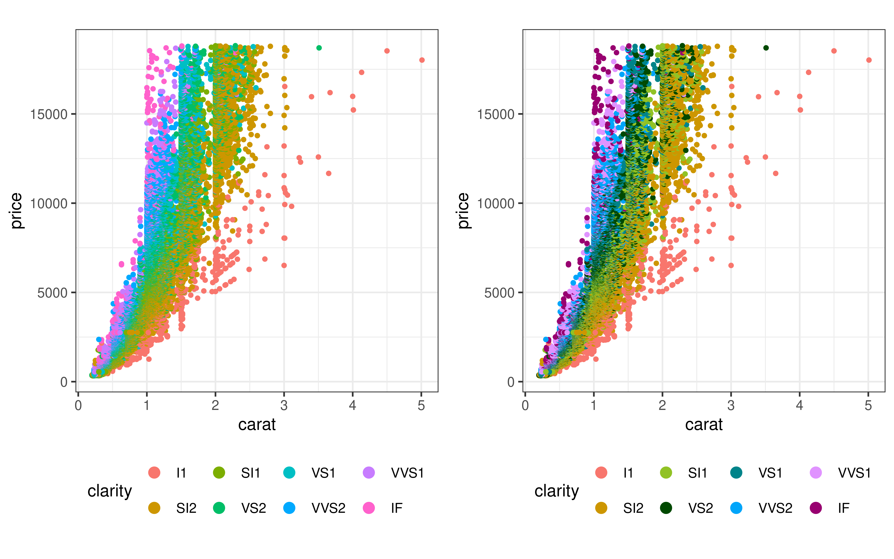
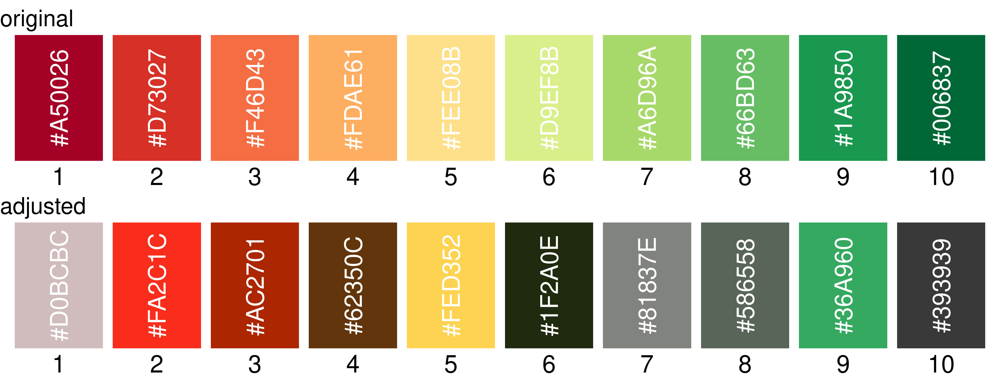

<!-- README.md is generated from README.Rmd. Please edit that file -->

# ggspruce

<!-- badges: start -->
<!-- badges: end -->

ggspruce provides functions that make automatic adjustments to ggplot2
plots to improve plot aesthetics.

## Installation

You can install the development version of ggspruce from
[GitHub](https://github.com/) with:

``` r
# install.packages("devtools")
devtools::install_github("sheridar/ggspruce")
```

<br>

## Optimizing color palettes

This is a color palette from the MetBrewer package. This palette can be
improved by modifying colors 2, 12, and 13 to make them more distinct.

``` r
library(ggspruce)
library(ggplot2)
library(MetBrewer)
library(cowplot)

clrs <- as.character(met.brewer("Austria", 15))

plot_colors(clrs)
```



The `spruce_up_colors()` function calculates the pairwise distance
between colors in the palette, and identifies pairs of colors that are
very similar. The difference threshold used to identify similar colors
can be modified with the `difference` parameter, with higher values
resulting in more distinct colors. The color palette is optimized by
modifying the color attribute specified with the `adjust` parameter.

In the example below, color lightness is automatically adjusted for sets
of colors that do not meet the difference threshold.

``` r
new_clrs <- clrs |>
  spruce_up_colors(
    difference = 10,
    adjust     = "lightness"
  )

plot_colors(new_clrs)
```


<br>

The colors can be made more distinct by also modifying the hue and/or
increasing the difference threshold.

``` r
new_clrs <- clrs |>
  spruce_up_colors(
    difference = 20,
    adjust     = c("lightness", "hue")
  )

plot_colors(new_clrs)
```



<br>

## Integration with ggplot2

Color palettes can be automatically modified on the fly using the
`scale_color_spruce()` and `scale_fill_spruce()` functions. These
functions are similar to the `ggplot2::scale_*_manual()` functions with
some modifications. Original colors are shown on the left and adjusted
colors on the right.

``` r
clrs <- as.character(met.brewer("Nattier", 8))

# Original colors
plt <- diamonds |>
  ggplot(aes(carat, price, color = clarity)) +
  geom_point(size = 1) +
  guides(color = guide_legend(override.aes = list(size = 3))) +
  theme_bw() +
  theme(
    aspect.ratio = 1,
    legend.position = "bottom"
  )

plt1 <- plt +
  scale_color_manual(values = clrs) +
  ggtitle("original")

# Automatically adjust colors
plt2 <- plt +
  scale_color_spruce(
    values     = clrs,
    difference = 25,
    adjust     = "lightness"
  ) +
  ggtitle("adjusted")

plot_grid(plt1, plt2, nrow = 1)
```


<br>

If no colors are provided to the `scale_*_spruce()` functions, they will
pull colors from the existing color scale.

``` r
# Plot original palette
plt1 <- plt +
  scale_color_hue()

# Adjust colors from existing scale
plt2 <- plt +
  scale_color_hue() +
  scale_color_spruce(difference = 30)

plot_grid(plt1, plt2, nrow = 1)
```



<br>

## Colorblind filters

Color similarity can be assessed and adjusted using colorblind filters.
The original and adjusted palettes are shown below.

``` r
library(colorspace)
library(RColorBrewer)

clrs <- RColorBrewer::brewer.pal(10, "RdYlGn")

new_clrs <- clrs |>
  spruce_up_colors(
    difference = 15,
    adjust     = c("lightness", "saturation"),
    filter     = "deutan"
  )

# Plot adjusted colors without filter
plt1 <- clrs |>
  plot_colors() +
  ggtitle("original")

plt2 <- new_clrs |>
  plot_colors() +
  ggtitle("adjusted")

plot_grid(plt1, plt2, ncol = 1)
```



The palettes are shown below using a filter to simulate deuteranopia.

``` r
# Plot adjusted colors with colorblind filter
plt3 <- clrs |>
  deutan() |>
  plot_colors() +
  ggtitle("original + filter")
  
plt4 <- new_clrs |>
  deutan() |>
  plot_colors() +
  ggtitle("adjusted + filter")
  
plot_grid(plt3, plt4, ncol = 1)
```


